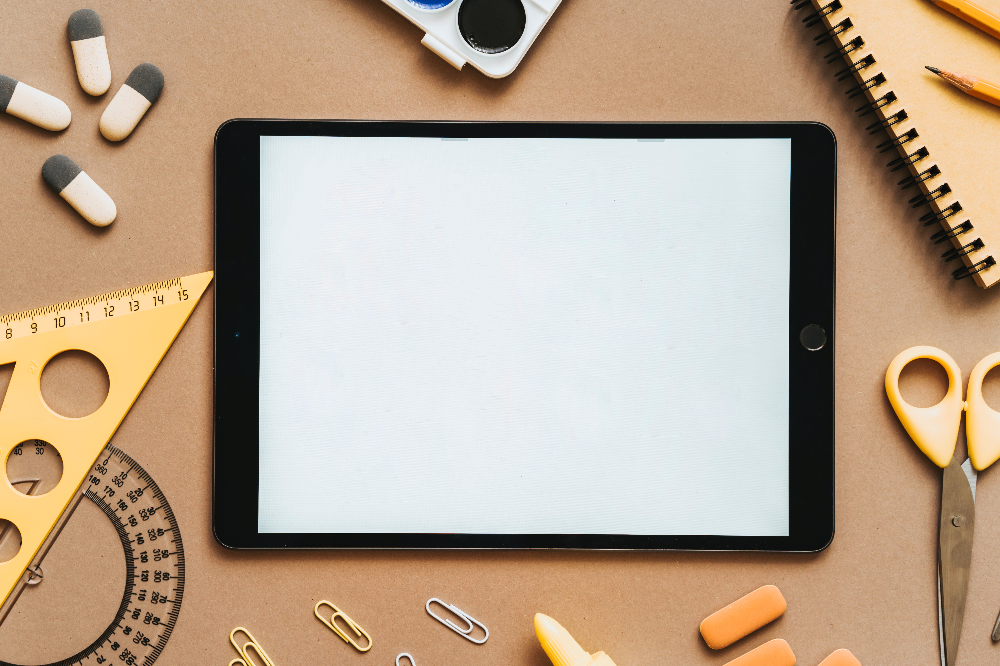

Devices zijn niet meer weg te denken uit het klaslokaal. Tablets, laptops, Chromebooks, zelfs smart phones zijn in toenemende mate vaste tools in het onderwijs, zoals een passer en geodriehoek dat ook zijn. Ook zijn onderwijskundige leermiddelen steeds vaker digitaal te verkrijgen. Afhankelijk van het beleid en de beschikbare devices binnen de school maken leerlingen ook (een deel van) hun toetsen digitaal. Met de opkomst van de mobiele devices is er minder noodzaak voor het inrichten van een computerlokaal. Leerlingen kunnen hun toets in de klas maken op hun (eigen) device. Afgezien van de technische uitdagingen, want niet elke toets kan zomaar op elk device gemaakt worden, is het de vraag of het voor het presteren van leerlingen op de toets eigenlijk uitmaakt welk device zij gebruiken.

In eerste instantie zou je misschien denken, wat maakt het uit of je de toets maakt op bijvoorbeeld een laptop of een tablet? Beide zijn digitale hulpmiddelen waarop de toets wordt weergegeven en je als leerlingen antwoorden kunt invoeren. Maar er zijn meerdere oorzaken waarom er toch verschil kán zijn wanneer leerlingen een zelfde toets op verschillende devices maken. In jargon wordt er gesproken over scorevergelijkbaarheid (Engels: score comparability). De vraag is dus: maakt het voor de vergelijkbaarheid van toetsscores uit op welk device de toets wordt gemaakt? Variabelen die een rol kunnen spelen in de relatie tussen device en scorevergelijkbaarheid zijn:

* **De toets**. Eigenschappen van de toets kunnen het makkelijker of moeilijker maken om op een van de devices te werken. Moet je bijvoorbeeld veel typen tijdens de toets, dan kan dat makkelijker gaan op een laptop dan op een tablet en ook houd je misschien meer tijd ovre als je typt op een laptop. Maar als je bijvoorbeeld moet slepen (zeg dat je een diagram moet maken) dan kan dat weer makkelijker gaan op een tablet dan op een laptop met muis of touch pad. Dat hoeft niet te zeggen dat het verschil maakt voor het eindproduct (de score op de toets), maar het kan wel zo zijn. Daarnaast kan het doel van de toets nog van belang zijn. Is het een summatieve of een formatieve toets?

* **De leerling**. Eigenschappen van de leerlingen kunnen ook invloed uitoefenen op de scorevergelijkbaarheid. Bijvoorbeeld als bepaalde leerlingen gewend zijn om veel op een bepaald device te doen (ook in de thuissituatie) terwijl andere leerlingen veel minder ervaren zijn. Of als de toets wordt gemaakt op een device waar tijdens het leerproces niet mee gewerkt is. Maar ook bepaalde andere eigenschappen van een leerling kunnen een rol spelen, bijvoorbeeld in de persoonlijkheid van een leerling.

* **De interface**. Eigenschappen van de interface kunnen, al dan niet in combinatie met het type device, ook de scorevergelijkbaarheid beïnvloeden. Bijvoorbeeld als bepaalde onderdelen in de toets niet goed vormgegeven zijn. Of als een knop op een (kleiner formaat) tablet bijna niet aan te klikken zijn.

* **De locatie**. Tot slot kan de locatie nog een rol spelen. Wordt de toets vanuit huis gemaakt, in de klas, of in een computerlokaal. Bepaalde onderdelen in die omgeving kunnen ervoor zorgen dat scores meer of minder vergelijkbaar worden. Bijvoorbeeld als je de toets individueel maakt op een tablet in een (drukke) klas of met de hele klas op laptops in een computerlokaal.

De wetenschappelijke literatuur over dit onderwerp is nog beperkt en niet eenduidig. Veelal is er ook uitsluitend onderzoek gedaan naar de vergelijking tussen een tablet en een laptop, of is alleen een summatieve context in beschouwing genomen. Rutkowski, Rutkowski, en Flores (2022) hebben als een van de eersten zeer recent een artikel gepubliceerd waarin zij de invloed van verschillende typen devices op de scores op een summatieve toets onderzoeken. Zij verzamelden daarvoor data van gestandaardiseerde toetsen voor de vakken Engels en wiskunde voor leerlingen (N = 82.848) in groep vijf van de basisschool en leerlingen (N = 82.657) in de tweede klas van het voortgezet onderwijs. Deze toetsen werden op verschillende devices afgenomen, namelijk iPad’s, Mac pc’s, desktop pc’s, en Chromebooks. De toetsen bestonden uit verschillende vraagtypen, waaronder multiple choice, kort antwoord, matching en uitgebreid antwoord. 

De resultaten laten zien dat voor de leerlingen in groep 5 geldt dat zij op zowel Engels als wiskunde het significant beter doen op de Chromebook, gevolgd door de iPad, desktop pc en de Mac pc. De verschillen tussen de gemiddeldes waren voor alle condities significant, behalve tussen de iPad en de desktop pc (voor zowel Engels als wiskunde). Opvallend genoeg lieten de resultaten voor de tweede klas zien dat leerlingen het juist significant beter deden op de iPad, gevolgd door de Chromebook, Mac pc en desktop PC. En hier waren de verschillen tussen de gemiddeldes voor de verschillende condities ook weer allemaal significant, behalve tussen de Chromebook en de Mac pc (zowel voor Engels als wiskunde). Hoewel sommige, weliswaar significante, verschillen tussen devices klein waren, waren er ook een aantal grotere verschillen. Zo deden tweede klas leerlingen, die op een iPad werkten, het aanzienlijk beter op de wiskunde toets ten opzichte van de leerlingen op een desktop pc. Het verschil in gemiddelde score tussen de twee groepen liep zelfs bijna op tot een halve standaarddeviatie. Overigens gebruikten de onderzoekers een gewogen procedure om de scores te berekenen, waar een aantal covariabelen in zijn meegenomen. Deze variabelen waren: geslacht, lunchkorting, wel of geen beperking, Engelse taalstatus, speciaal onderwijs status, en afkomst. De vergelijkingen tussen de scores, gerealiseerd op verschillende typen devices, lijken daarmee behoorlijk goed te vergelijken.

Hoe kan het zo zijn dat er geen scorevergelijkbaarheid is? De onderzoekers gaan er vanuit dat er geen intrinsiek voordeel is van een iPad of een Chromebook ten opzichte van andere devices. zij beargumenteren dat een potentiële verklaring kan liggen in het feit dat leerlingen meer gewend zijn aan bepaald type device. iPads en Chromebooks zijn bijvoorbeeld dominant in scholen in Indiana (de Amerikaanse staat waarin dit onderzoek is uitgevoerd). Zij achten het waarschijnlijk dat leerlingen die werkten op een Mac pc of een desktop PC dit deden in computerlokalen. En dat zij dus niet dagelijks op deze devices werkten. Als bekend zijn met een type device de meest plausibele verklaring is dan indiceert dat ook dat scholen die niet kunnen werken op bepaalde devices, omdat zij daar niet voldoende resources voor hebben, systematisch op een achterstand komen te staan waar het high-stakes toetsen betreft. Er is geen reden om aan te nemen dat dit niet zou gelden in Nederland.

Nog een andere verklaring is dat fysieke eigenschappen van de devices op zich het presteren beïnvloeden. Hierbij kun je denken (zoals al eerder genoemd in deze blog) aan het formaat van het scherm, touch screen of niet, type input (typen op het scherm vs. toetsenbord), etc. Helaas biedt het artikel van Rutkowski et al. hier geen antwoord op. Zij wisten weliswaar op welk type device de toets was gemaakt, maar verder geen specifieke eigenschappen van die devices, zoals het schermformaat. iPad’s worden bijvoorbeeld gemaakt van 8.3” (iPad mini) tot 12.9” (iPad pro).

Samenvattend kan gesteld worden dat er meerdere variabelen zijn die een effect kunnen uitoefenen op de relatie tussen type device en score op de toets (scorevergelijkbaarheid). In het betreffende onderzoek is vooral gekeken naar de invloed van type device op scorevergelijkbaarheid. Zij hebben daarbij veel data verzameld, verdeeld over twee leeftijdsgroepen en twee kennisgebieden. Naar mijn mening enigszins verrassend is toch wel dat er tussen sommige devices relatief grote verschillen in score zijn gevonden. Waarbij iPad’s en Chromebooks er ‘het beste’ uitkomen. De meest waarschijnlijke verklaring is dat dit komt door bekendheid met het type device. Verder onderzoek moet uitwijzen of fysieke eigenschappen van devices (ook) een rol spelen. 
Het volledige artikel kan hier gevonden worden: [link](https://doi.org/10.1080/10627197.2022.2043742).

David Rutkowski, Leslie Rutkowski & Charity Flores (2022): The Effect of 
&nbsp;&nbsp;&nbsp;&nbsp;&nbsp;&nbsp;Device Type on Achievement: Evidence from a Quasi-Experimental Design, 
&nbsp;&nbsp;&nbsp;&nbsp;&nbsp;&nbsp;Educational Assessment, DOI: 10.1080/10627197.2022.2043742

